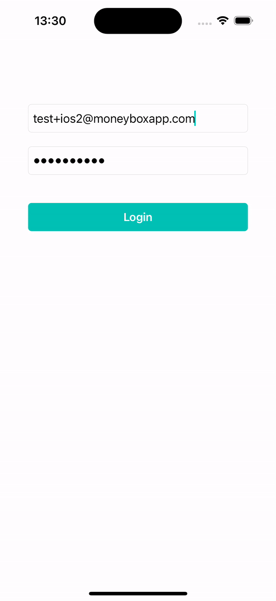

# Moneybox iOS Technical Challenge

## Solution

In this solution, I've implemented a basic iOS application following the MVVM (Model-View-ViewModel) pattern to manage the UI and business logic separately. Here's a summary of the achieved tasks:

Login Functionality: Implemented a login screen with email and password fields using a LoginViewController and LoginViewModel. The ViewModel handles the business logic for validating user credentials and making login requests.

Products Display: Created a ProductsViewController and ProductsViewModel to display a list of products. The ViewModel fetches product data from the backend using a DataProvider and updates the UI accordingly.

Product Detail View: Implemented a ProductDetailViewController to display detailed information about a selected product. Added functionality to navigate to this detail view from the products list.

Add Money Feature: Added a button in the ProductDetailViewController to add £10 to the moneybox value of the selected product. This button triggers an API request to update the moneybox value.

UI Styling: Applied UI styling to the various components, including buttons, labels, and text fields, to improve the overall look and feel of the application.

Loading States: Incorporated loading states to indicate when data is being fetched from the backend, providing better feedback to the user.

Overall, while the solution may not be optimal and there is room for improvement, it demonstrates the basic implementation of MVVM architecture in Swift for an iOS application, covering essential features such as login, data fetching, navigation, and API integration.
